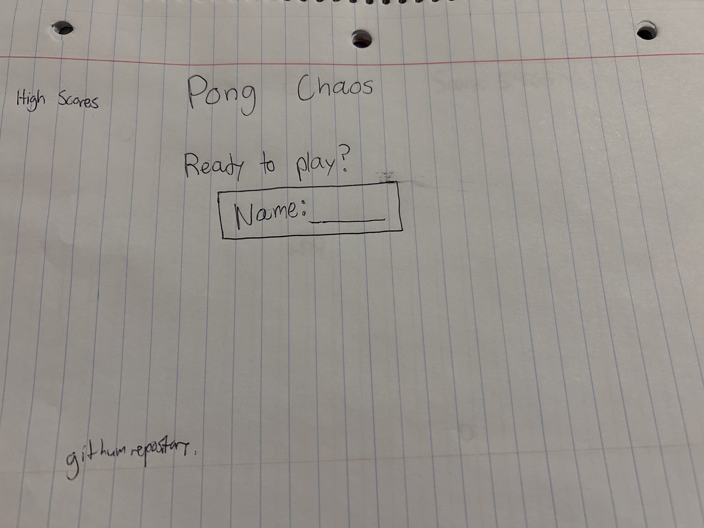
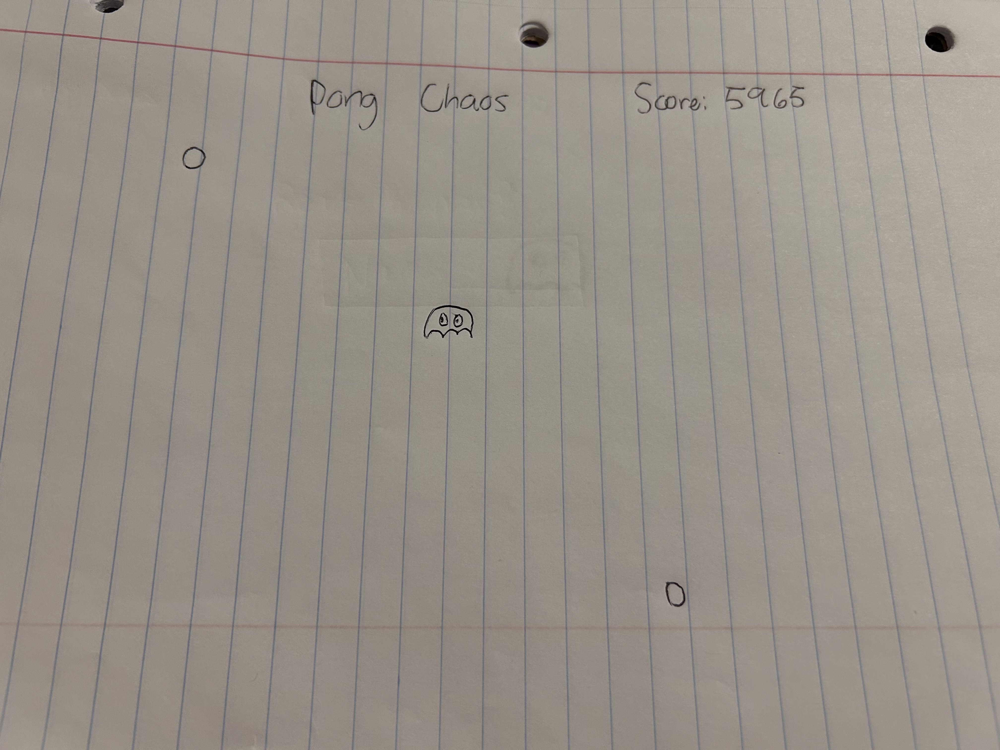
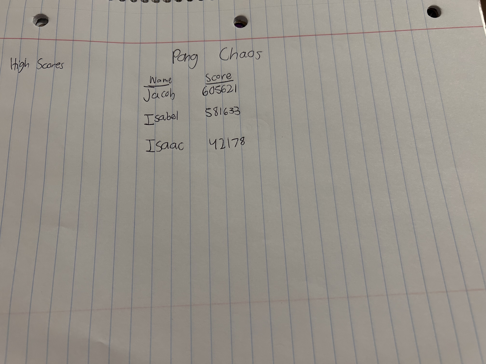

# Pong Chaos

[My Notes](notes.md)

## Game Overview
This is a simple game in which the user will input their name to begin. After, the game begins and two balls starting bouncing off the walls, getting faster as they go. The player can control their character, moving around the area and will keep playing as long as they avoid the balls. Their score increases as the game continues, until the chracter is hit with the ball. Powerups periodically appear, temporarily slowing down the speed of the balls or increasing the speed of the player.

> [!NOTE]
>  This is a template for your startup application. You must modify this `README.md` file for each phase of your development. You only need to fill in the section for each deliverable when that deliverable is submitted in Canvas. Without completing the section for a deliverable, the TA will not know what to look for when grading your submission. Feel free to add additional information to each deliverable description, but make sure you at least have the list of rubric items and a description of what you did for each item.

> [!NOTE]
>  If you are not familiar with Markdown then you should review the [documentation](https://docs.github.com/en/get-started/writing-on-github/getting-started-with-writing-and-formatting-on-github/basic-writing-and-formatting-syntax) before continuing.

## 🚀 Specification Deliverable

> [!NOTE]
>  Fill in this sections as the submission artifact for this deliverable. You can refer to this [example](https://github.com/webprogramming260/startup-example/blob/main/README.md) for inspiration.

For this deliverable I did the following. I checked the box `[x]` and added a description for things I completed.

- [x] Proper use of Markdown
- [x] A concise and compelling elevator pitch
- [x] Description of key features
- [x] Description of how you will use each technology
- [x] One or more rough sketches of your application. Images must be embedded in this file using Markdown image references.

### Elevator pitch

Everyone is familiar with the game pong. It's simple yet fun. But what if instead of hitting the ball, you needed to avoid it? And what if there is not one, but two balls to avoid? The chaos gets crazier when we throw in some powerups too! You absolutely can't miss out on this crazy adventure.

### Design

This is the main screen where the player will enter their name

This is where the game is played, until the player is hit by one of the balls

Here the high scores are shown

### Key features

- Name of player is stored
- Balls are bounced around at increasingly faster rates
- Powerups are randomly placed periodically
- Player controls character's movement
- When ball hits character, game is over
- Score is stored with name of player
- High scores are shown

### Technologies

I am going to use the required technologies in the following ways.

- **HTML** - Has 3 different HTML pages. One for the main screen, one for the game itself, and one with the high scores. The high scores and main screen have links to each other.
- **CSS** - Easy to read font, nice and big. Preferably white, to keep a retro asthetic. With a black background. 
- **React** - Has a name box, balls that move and get faster. Character is controlled with arrow keys. 
- **Service** - Backend service with endpoints for:
-Storing high scores and names
-Login in with name
-Random fact
- **DB/Login** - Stores the 3 top high scores
- **WebSocket** - Anytime a user creates a new game

## 🚀 AWS deliverable

For this deliverable I did the following. I checked the box `[x]` and added a description for things I completed.

- [x] **Server deployed and accessible with custom domain name** - [My server link](https://pongchaos.com).

## 🚀 HTML deliverable

For this deliverable I did the following. I checked the box `[x]` and added a description for things I completed.

- [x] **HTML pages** - I did the HTML pages. There is an index, play, and high score HTML page. 
- [x] **Proper HTML element usage** - I included headers, body, and footers on each page. Along with navigation at the top.
- [x] **Links** - The navigation bar has links to the home page and high scores page. I also included ny github link on every page.
- [x] **Text** - There is text explaining that the user enter their name.
- [x] **3rd party API placeholder** - A random fact will be stored in the footer of the home page.
- [x] **Images** - I included the character image on the play screen.
- [x] **Login placeholder** - I put a text box that asks for the user's name. I also included the name of the game on each page.
- [x] **DB data placeholder** - Text box with submit button to store user's name.
- [x] **WebSocket placeholder** - High scores are stored in server so that the top 3 can be displayed.

## 🚀 CSS deliverable

For this deliverable I did the following. I checked the box `[x]` and added a description for things I completed.

- [x] **Header, footer, and main content body** - Game title, menu, body, and name with githib link included
- [x] **Navigation elements** - Home and High Scores included
- [x] **Responsive to window resizing** - Did it
- [x] **Application elements** - Done
- [x] **Application text content** - Table with high scores included
- [x] **Application images** - Avatar image included

## 🚀 React part 1: Routing deliverable

For this deliverable I did the following. I checked the box `[x]` and added a description for things I completed.

- [x] **Bundled using Vite** - I bundled it using VITE
- [x] **Components** - I successfully converted my html to react components. It looks great!
- [x] **Router** - There is routing between the login and scores page. You can also acess the play page by logging in.

## 🚀 React part 2: Reactivity

For this deliverable I did the following. I checked the box `[x]` and added a description for things I completed.

- [x] **All functionality implemented or mocked out** - I did this, mocking out the random fact generator.
- [x] **Hooks** - I did this, it was not easy to implement especially in the play.jsx file, but I got it to work.

## 🚀 Service deliverable

For this deliverable I did the following. I checked the box `[x]` and added a description for things I completed.

- [x] **Node.js/Express HTTP service** - I did this.
- [x] **Static middleware for frontend** - I did this.
- [x] **Calls to third party endpoints** - I did this.
- [x] **Backend service endpoints** - I did this.
- [x] **Frontend calls service endpoints** - I did this.

## 🚀 DB/Login deliverable

For this deliverable I did the following. I checked the box `[x]` and added a description for things I completed.

- [ ] **User registration** - I did not complete this part of the deliverable.
- [ ] **User login and logout** - I did not complete this part of the deliverable.
- [ ] **Stores data in MongoDB** - I did not complete this part of the deliverable.
- [ ] **Stores credentials in MongoDB** - I did not complete this part of the deliverable.
- [ ] **Restricts functionality based on authentication** - I did not complete this part of the deliverable.

## 🚀 WebSocket deliverable

For this deliverable I did the following. I checked the box `[x]` and added a description for things I completed.

- [ ] **Backend listens for WebSocket connection** - I did not complete this part of the deliverable.
- [ ] **Frontend makes WebSocket connection** - I did not complete this part of the deliverable.
- [ ] **Data sent over WebSocket connection** - I did not complete this part of the deliverable.
- [ ] **WebSocket data displayed** - I did not complete this part of the deliverable.
- [ ] **Application is fully functional** - I did not complete this part of the deliverable.
