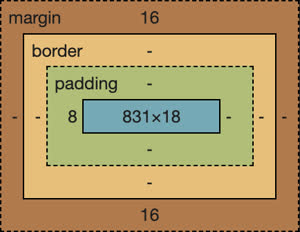

# CS 260 Notes

[My startup - Simon](https://simon.cs260.click)

## Helpful links

- [Course instruction](https://github.com/webprogramming260)
- [Canvas](https://byu.instructure.com)
- [MDN](https://developer.mozilla.org)

## Github
When it comes to github, I need to commit the changes I make, very frequently. 

## AWS
The collection of technologies that you use to create or deliver your web application is called a technology stack. Generally at the top of the stack is your web framework.

an IP address can be referenced by a domain name

The Amazon Web services EC2 has a ton of useful info about the server.

IP address of my server: http://44.211.203.75/

Command to remote shell into my server - ➜  ssh -i [key pair file] ubuntu@[ip address]

Domain names are broken up into a root domain, with one or more possible subdomain prefixes

## HTML
HTML is almost completely about structure, not so much about visual appearance
Elements are represented with enclosing tags. Ex: <body> </body>
HTML defines a header (<!DOCTYPE html>) that tells the browser the type and version of the document. You should always include this at the top of the HTML file.
Always start with the html element Ex:<!DOCTYPE html>
                                      <html lang = "en"> 
                                          <head>
                                          </head>
                                          <body>
                                          </body>
                                       </html>
Every element can have attributes
Attributes describe the specific details of the element Ex: class = "opener"
Hyperlinks are represented with an anchor element with href as an attribute. Ex: <a href = "faecbook.com/bobgrader">My Facebook</a>
You can include comments in your HTML files by starting the comment with <!-- and ending it with -->
There are special characters that you have to escape using the entity syntax:
Character	Entity
    &	    &amp;
    <	    &lt;
    >	    &gt;
    "	    &quot;
    '	    &apos;
    😀	  &#128512;
A block element is meant to be a distinct block in the flow of the content structure
An inline element is meant to be inline with the content flow of a block element

Inputs:
Form-The main purpose of the form element is to submit the values of the inputs it contains. 
Input element-represents many different input types. You set the type of input with the type attribute. 

To upload to production environment:
./deployFiles.sh -k <yourpemkey> -h <yourdomain> -s startup 

This was not too bad, I just had to make sure I got the footer where I wanted it to. I created an image for the character and iamges for the pong balls. These still don't show since I have not made the background black yet.

## CSS
CSS is primarily concerned with defining rulesets, or simply rules. A rule is comprised of a selector that selects the elements to apply the rule to, and one or more declarations that represent the property to style with the given property value

The rules cascade down from the highest nodes in the DOM tree to the lowest level. Any declaration property defined at a lower level will override the higher declaration.

CSS treats every element as a series of nested rectangular boxes. The innermost box contains the actual content (like text or images). Surrounding that is the padding, which inherits styling such as background color. Next is the border, which can have specific properties like color and thickness. Finally, the margin wraps the element, providing whitespace without affecting the styling.

You can change the box-sizing CSS property from the default value of content-box to border-box in order to redefine the width and height to also include the padding and the border. This often makes it easier to style elements when their visual size matches their actual size.

I had some diffculty with spacing for the menu but I figured it out. The balls look super cool and I am happy with how the website looks so far.

## React Part 1: Routing

One of the simplest ways to debug your JavaScript code is to insert console.log functions that output the state of the code as it executes
Use command + option + j to open chrome debugger

React components allow you to modularize the functionality of your application. This allows the underlying code to directly represent the components that a user interacts with. It also enables code reuse as common application components often show up repeatedly.

One of the primary purposes of a component is to generate the user interface. This is done with the JSX returned from a component. Whatever is returned, inserted into the component HTML element.

If you don't want to directly style your components with inline CSS rule sets, you can reference and external CSS file and then reference the rules in your JSX just like you would normally do with HTML. You could apply the style rules using importing the CSS. The styles will then apply as they would normally, with the exception that you need to use className attribute on an element instead of class because class is a keyword in JavaScript.

React components also allow you to pass information to them in the form of element properties. The component receives the properties in its constructor and then can display them when it renders.

A component can have internal state. Component state is created by calling the React.useState hook function. The useState function returns a variable that contains the current state and a function to update the state. 

A component's properties and state are used by the React framework to determine the reactivity of the interface. Reactivity controls how a component reacts to actions taken by the user or events that happen within the application. Whenever a component's state or properties change, the render function for the component and all of its dependent component render functions are called.

## React Part 2: Reactivity

The simon code helped me to understand how to implement react and make the website interactive.

However, I had used chatgpt to write a lot of the ball.jsx and play.jsx files so I had to redo those and switch some things because it was super buggy.

I had to take away my powerup idea because it wasn't working well. I also made it so there is only one ball.

I learned that you have to be super sareful when AI writes code, you have to understand every bit. Preferably, you write the code and then use AI to correct your code. 

## Service Requests
An API is like a doorway into the app

The get request retrieves data
The post request is meant to modify the state of the underlying data. It creates new resources.
The put request is meant to update an existing resource.
The delete request removes a record/resource.

After making this request, the app will respond to your request usually in a json format.